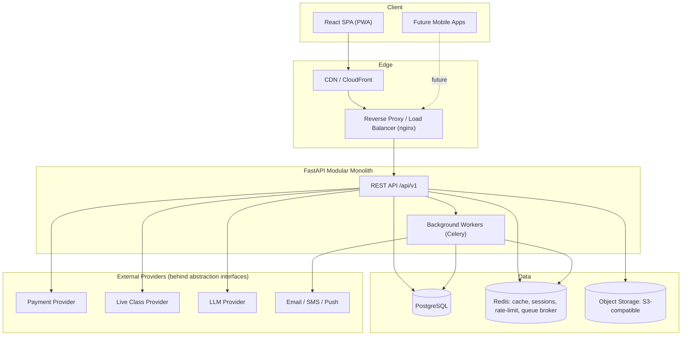
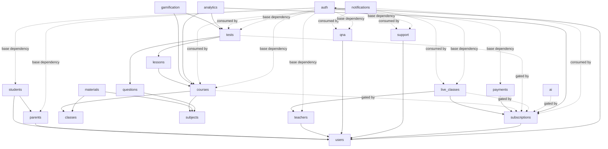

# EduSphere CBSE — System Architecture

> "EduSphere CBSE" is a placeholder working name (see master spec §50). It lives in config/env,
> not hardcoded through the codebase, so rebranding later is a config change, not a refactor.

## 1. Product Vision

EduSphere CBSE is an original, India-focused online learning platform for CBSE students
(primarily classes 6–12) covering video lessons, study material, live classes, an online
test engine, Q&A, subscriptions, and an AI learning assistant — serving students, parents,
teachers, and administrators through role-specific experiences, built on an API-first
architecture that can scale from an initial cohort of thousands of concurrent users toward
millions without a rewrite.

## 2. Assumptions & Defaults

The master spec intentionally leaves many decisions open ("classes should be configurable",
"do not hardcode provider X", etc.). Rather than block on every micro-decision, this
document fixes the following defaults. They are all reversible via config/abstraction, not
architectural dead ends:

| Area | Default assumption | Why it's safe to defer-proof |
|---|---|---|
| Tenancy | Single-tenant platform (one school-agnostic public product), not white-label/multi-tenant | Multi-tenancy can be added later via a `tenant_id` column if ever needed; not required for v1 |
| Localization | UI copy in English, i18n-ready (string keys, not hardcoded text) — Hindi (and other) content supported as a *content* attribute (e.g. `language` field on lessons/materials), not a full UI translation in v1 | Keeps v1 scope sane while not blocking bilingual content |
| Mobile apps | Out of scope for v1 build; backend is API-first (§44) so Android/iOS can consume the same `/api/v1` surface later | No backend rework needed later |
| Seed/demo content | 100% original, fictional educational text. Never NCERT/CBSE copyrighted text (§37) | Legal/compliance requirement, non-negotiable |
| Payments | `PaymentProvider` interface; Razorpay is the default concrete adapter (India-first, UPI support) | Cashfree/Stripe adapters can be added without touching call sites |
| Object storage | `StorageProvider` interface; AWS S3 is the default concrete adapter | Cloudflare R2 / Azure Blob adapters plug in later |
| Video delivery | `VideoProvider` interface; default adapter is S3 + CloudFront signed URLs (self-hosted HLS-style) | YouTube-unlisted / Vimeo adapters can be added later |
| Live classes | `LiveClassProvider` interface; default adapter is **Jitsi** (self-hostable, no vendor lock-in for a v1 that hasn't negotiated a Zoom/Meet contract) | Zoom/Meet/WebRTC-custom adapters plug in later |
| AI assistant | `LLMProvider` interface; concrete adapter selected via env var, not named here to stay vendor-neutral | Swappable without touching the `ai` module's business logic |
| Scale target | Architected so stateless app servers + managed Postgres/Redis can scale horizontally to "millions of students"; **not** provisioned at that scale on day one | Avoids over-engineering v1 infra spend |
| Branding | "EduSphere CBSE" name/logo/colors live in `frontend/src/config` and env, never string-literal'd across 50 files | Rebrand = edit config, not grep-and-replace |

## 3. High-Level System Architecture



The backend starts as a **modular monolith**: one FastAPI deployable, internally partitioned
into business modules with clean boundaries (see §7), so any module can later be extracted
into its own service without a rewrite — only once real scale/team-size justifies the
operational cost of microservices.

## 4. Tech Stack

| Layer | Choice | Notes |
|---|---|---|
| Frontend framework | React + TypeScript + Vite | Fast dev server, native TS support |
| Styling | Tailwind CSS | Utility-first, pairs with a small design-token layer |
| Routing | React Router | Role-guarded route groups |
| Server state | TanStack Query | Caching, refetch, optimistic updates |
| Forms & validation | React Hook Form + Zod | Shared schema validation, mirrors backend Pydantic shapes |
| HTTP client | Axios | Interceptors for auth refresh, error envelope unwrapping |
| Backend framework | FastAPI (Python) | Async, OpenAPI generation out of the box |
| ORM / migrations | SQLAlchemy 2.0 + Alembic | Typed models, versioned schema migrations |
| Validation | Pydantic v2 | Request/response schemas, settings |
| Auth | JWT (access + refresh) via `python-jose`/`authlib` | See §8 for token handling |
| Background jobs | Celery + Redis broker | Emails, notifications, video post-processing, report generation |
| Primary database | PostgreSQL | Normalized relational schema, see DATABASE_DESIGN.md |
| Cache / broker | Redis | Cache, session support, rate limiting, Celery broker |
| Object storage | S3-compatible (abstracted) | Video, PDFs, images |
| Containerization | Docker + Docker Compose | Local dev + first production deploys |
| Future orchestration | Kubernetes | Once traffic/ops justify it |

## 5. Project Folder Structure

```
cbse-learning-platform/
├── frontend/
│   ├── public/
│   └── src/
│       ├── components/
│       │   └── ui/            # Button, Input, Modal, Card, Table, Tabs, Badge, ...
│       ├── pages/              # Route-level pages (per role)
│       ├── features/           # Feature-sliced modules (courses, tests, live-classes, qna, ...)
│       ├── hooks/
│       ├── lib/                 # axios client, query client, i18n, utils
│       ├── routes/              # role-guarded route trees
│       ├── store/               # minimal client state (auth session, ui state)
│       └── types/
├── backend/
│   └── app/
│       ├── api/                 # API-level composition / versioned router mounting
│       ├── core/                # settings, security, logging, config
│       ├── models/               # SQLAlchemy base + shared mixins
│       ├── schemas/               # shared/cross-module Pydantic schemas
│       ├── repositories/          # shared repository base classes
│       ├── services/               # shared/cross-module services
│       ├── routers/                 # top-level router aggregation
│       ├── dependencies/             # FastAPI Depends: auth, permissions, pagination
│       ├── middleware/                # CORS, request logging, error handling
│       ├── tasks/                      # Celery task registration
│       ├── modules/
│       │   ├── auth/
│       │   ├── users/
│       │   ├── students/
│       │   ├── parents/
│       │   ├── teachers/
│       │   ├── classes/
│       │   ├── subjects/
│       │   ├── courses/
│       │   ├── lessons/
│       │   ├── materials/
│       │   ├── tests/
│       │   ├── questions/
│       │   ├── live_classes/
│       │   ├── qna/
│       │   ├── subscriptions/
│       │   ├── payments/
│       │   ├── notifications/
│       │   ├── support/
│       │   ├── gamification/
│       │   ├── analytics/
│       │   └── ai/
│       │       # each module: router.py, service.py, repository.py, schemas.py, models.py
│       └── main.py
├── database/                     # Alembic env, seed scripts, ERD assets
├── docs/
├── deployment/                    # Dockerfiles, docker-compose, nginx conf, k8s manifests (future)
├── scripts/                        # dev/setup/seed helper scripts
└── tests/
    ├── backend/
    │   ├── unit/
    │   └── integration/
    └── frontend/
        ├── unit/
        └── e2e/
```

Each backend module is self-contained (`router.py` → `service.py` → `repository.py` →
`models.py`, with `schemas.py` for request/response shapes) so business logic never leaks
into route handlers and database access never leaks into the frontend.

## 6. Module Dependency Diagram



`auth` is the base dependency for nearly every module (via a shared "current user" dependency).
`subscriptions` acts as a gate in front of premium `courses`/`tests`/`live_classes`/`ai` access
rather than a hard code dependency — enforced by a permission/entitlement check, not a direct
import, keeping those modules usable in "free tier" mode without `subscriptions` in the loop.

## 7. Frontend Architecture

- **Routing**: role-guarded route groups — `/student/*`, `/teacher/*`, `/parent/*`, `/admin/*`,
  plus public routes (home, pricing, course catalog, help center). A `RoleGuard` wrapper
  reads the authenticated user's role from the session store and redirects unauthorized
  access; this is a UX convenience only — the backend RBAC is the real authorization boundary.
- **State management**: server state (courses, tests, progress, etc.) lives in TanStack
  Query — no duplication into a global store. Client-only UI state (sidebar open/closed,
  active theme, current session/user snapshot) lives in a minimal store (e.g. Zustand-style),
  kept intentionally small.
- **Design system**: `components/ui/` holds framework-agnostic primitives (Button, Input,
  Select, Modal, Dialog, Dropdown, Card, Table, Tabs, Badge, Avatar, Tooltip, Toast, Progress,
  Skeleton, Pagination, Breadcrumb, Sidebar, Navbar, Footer) per master spec §30. Feature-level
  composites (VideoPlayer, QuestionCard, TestNavigator, CourseCard, TeacherCard,
  LiveClassCard) live under `features/*` and compose the primitives — never duplicated per page.
- **Auth token handling**: refresh token in an httpOnly, Secure, SameSite cookie; access
  token held in memory only (never `localStorage`/`sessionStorage`) to reduce XSS token-theft
  surface. Axios response interceptor handles silent refresh on 401.

## 8. Backend Architecture

- **Layered architecture per module**: `router.py` (HTTP concerns only) → `service.py`
  (business logic, orchestration) → `repository.py` (data access, SQLAlchemy queries) →
  `models.py` (ORM models). Route handlers stay thin; they parse/validate via `schemas.py`
  and delegate to the service layer.
- **Dependency injection**: FastAPI `Depends` wires repositories into services and services
  into routers, and supplies cross-cutting dependencies: `get_current_user`,
  `require_permission("course:create")`, `get_db_session`, `get_pagination_params`.
- **RBAC enforcement**: a `require_permission(...)` dependency checks the current user's
  role → permission mapping (loaded from `roles`/`permissions`/`role_permissions`) on every
  protected route. This is enforced server-side unconditionally; the frontend's route guards
  are UX only, never the security boundary (master spec §22, §27).
- **Settings**: `pydantic-settings` `Settings` class reads all config from environment
  variables (see `.env.example`), no secrets in source.
- **Provider abstraction pattern**: every external integration point is an abstract base
  class with a concrete adapter selected at startup via env var + a small factory/DI
  provider. Example (illustrative, not final code):

```python
# backend/app/modules/payments/providers/base.py
from abc import ABC, abstractmethod

class PaymentProvider(ABC):
    @abstractmethod
    async def create_order(self, amount_paise: int, currency: str, receipt: str) -> "PaymentOrder":
        ...

    @abstractmethod
    async def verify_webhook(self, payload: bytes, signature: str) -> "PaymentEvent":
        ...

    @abstractmethod
    async def refund(self, payment_id: str, amount_paise: int | None = None) -> "RefundResult":
        ...
```

The same pattern applies to `StorageProvider`, `VideoProvider`, `LiveClassProvider`, and
`LLMProvider` — services depend on the interface, never on a named vendor SDK directly.

## 9. API Architecture

- **Versioning**: all routes under `/api/v1/...`.
- **Pagination**: `?page=&page_size=` (or cursor-based for high-volume feeds like
  notifications/audit logs), with `X-Total-Count` or an envelope `meta.total`.
- **Filtering/sorting**: `?filter[field]=value&sort=-created_at` convention, module-specific
  filters documented per endpoint in the OpenAPI schema (auto-generated by FastAPI).
- **Response envelope** (success):

```json
{
  "success": true,
  "data": { "...": "..." },
  "meta": { "page": 1, "page_size": 20, "total": 134 }
}
```

- **Response envelope** (error) — matches master spec §39:

```json
{
  "success": false,
  "error": {
    "code": "COURSE_NOT_FOUND",
    "message": "Course not found"
  }
}
```

- **Auth flow**: `POST /auth/register` → `POST /auth/login` (issues access + refresh) →
  `POST /auth/refresh` → `POST /auth/logout` (revokes refresh token server-side).
- **Representative endpoints per module** (pattern shown, not exhaustive CRUD — full list
  will live in the generated OpenAPI/Swagger doc once implemented):

| Module | Base path | Notable non-CRUD endpoints |
|---|---|---|
| auth | `/api/v1/auth` | `login`, `refresh`, `logout`, `password-reset` |
| classes/subjects | `/api/v1/classes`, `/api/v1/subjects` | standard CRUD (admin-only writes) |
| courses/lessons | `/api/v1/courses`, `/api/v1/lessons` | `lessons/{id}/progress`, `lessons/{id}/complete` |
| materials | `/api/v1/materials` | `materials/{id}/download` |
| tests | `/api/v1/tests` | `tests/{id}/start`, `tests/{id}/submit`, `tests/{id}/result` |
| live_classes | `/api/v1/live-classes` | `live-classes/{id}/join`, `live-classes/{id}/attendance` |
| qna | `/api/v1/qna` | `qna/questions/{id}/answers`, `qna/questions/{id}/upvote` |
| subscriptions | `/api/v1/subscriptions` | `subscriptions/plans`, `subscriptions/subscribe`, `subscriptions/cancel` |
| payments | `/api/v1/payments` | `payments/create`, `payments/webhook` |
| notifications | `/api/v1/notifications` | `notifications/{id}/read` |
| support | `/api/v1/support` | `support/tickets`, `support/tickets/{id}/messages` |

See `docs/API_DOCUMENTATION.md` for the compact reference version of this table.

## 10. Security Architecture

- **RBAC**: roles `SUPER_ADMIN, ADMIN, CONTENT_MANAGER, TEACHER, SUPPORT_AGENT, STUDENT,
  PARENT`, permissions as `resource:action` strings (`course:create`, `payment:refund`, ...),
  enforced via the `require_permission` dependency on every protected route — never trusted
  from the frontend alone (master spec §22).
- **Auth security controls**: bcrypt/argon2 password hashing, short-lived JWT access tokens
  + rotating refresh tokens, rate limiting on auth endpoints (Redis-backed), account lockout
  after repeated failures, CORS allowlist via `CORS_ORIGINS`, input validation via Pydantic
  everywhere, parameterized queries only (SQLAlchemy ORM — no raw string interpolation),
  output encoding on the frontend to prevent XSS.
- **Minor-safety (this platform serves minors — master spec §28)**:
  - Data minimization: student profiles collect only what's needed for learning (no
    unnecessary PII).
  - Parent–student linkage is an explicit, auditable relationship (`parent_profiles` ↔
    `student_profiles` link table), not inferred.
  - No unmoderated 1:1 private messaging between students and teachers — communication is
    scoped to Q&A threads (moderated, visible, reportable) and live-class chat (logged,
    teacher-moderated). This is a deliberate constraint, not an oversight.
  - Content moderation hooks on Q&A submissions (report button, admin review queue).
  - Full audit logging (`audit_logs`) on administrative and sensitive actions (§40).
  - Data deletion workflow: soft-delete + a documented hard-delete/export path for
    account-deletion requests.
- **Secrets**: environment variables only, never committed; `.env.example` documents names,
  never values.

## 11. Deployment Architecture

`docker-compose.yml` (to be created in Phase 12) will define:

| Service | Role |
|---|---|
| `frontend` | Vite build served via nginx (or a lightweight static server) |
| `backend` | FastAPI app (Uvicorn/Gunicorn) |
| `worker` | Celery worker process, same codebase as backend |
| `postgres` | Primary database |
| `redis` | Cache + Celery broker |
| `nginx` (optional) | Reverse proxy / TLS termination in front of frontend+backend |

Env var categories needed at deploy time (see `.env.example` for the full name list):
general/environment, database, cache, JWT/auth, payment provider credentials, storage
provider credentials, LLM provider credentials, SMTP credentials.

**Path to Kubernetes**: the backend is designed stateless (session state in Redis/JWT, not
in-process) so backend pods can scale horizontally behind a Service/Ingress once traffic
justifies it; Postgres/Redis move to managed equivalents; object storage is already external.
No architectural change required to make that jump — only ops tooling.

## 12. Development Roadmap (12 Phases)

| Phase | Scope | "Done" looks like |
|---|---|---|
| 1 | Product/DB architecture, project structure, design system | This document set + repo skeleton merged (current phase) |
| 2 | Auth, users, roles, permissions | Register/login/refresh/logout working end-to-end with RBAC enforced on a sample protected route |
| 3 | Classes, subjects, courses, chapters, lessons | Admin can CRUD academic hierarchy; student can browse a course's lesson tree |
| 4 | Study materials, video learning, progress tracking | Student can watch a video (resume position persisted), download a material, mark a lesson complete |
| 5 | Test engine, questions, results, analytics | Student can start/submit a chapter test and see a scored result breakdown |
| 6 | Live classes, Q&A | Teacher can schedule a class via the `LiveClassProvider` abstraction; student can ask/answer in Q&A |
| 7 | Subscriptions, payments, invoices | Student can subscribe to a paid plan via the `PaymentProvider` abstraction and receive an invoice |
| 8 | Notifications, help, support | In-app notification fires on a test result; student can open/close a support ticket |
| 9 | Gamification, personalization, AI assistant | Streaks/badges awarded on real activity; AI assistant answers a sample question via `LLMProvider` |
| 10 | Admin dashboard, reports, analytics | Admin sees live counts/charts backed by real queries, not mock data |
| 11 | Testing, security, performance | CI runs unit+integration+e2e suites green; basic load/security pass complete |
| 12 | Docker, deployment, production readiness | `docker-compose up` brings up the full stack from a clean checkout |

---

Implementation does not begin until this architecture is explicitly approved (master spec §53).
