# EduSphere CBSE — Database Design

PostgreSQL, normalized relational schema. See `docs/ARCHITECTURE.md` for how this fits the
overall system.

## Conventions

- **Primary keys**: UUID on every table (`id UUID PRIMARY KEY DEFAULT gen_random_uuid()`),
  so IDs are safe to expose in URLs/APIs without leaking sequence/volume information.
- **Timestamps**: every table has `created_at` and `updated_at` (server-set, UTC).
- **Soft delete**: content/entity tables that users might "undo" a delete on — `courses`,
  `chapters`, `topics`, `lessons`, `study_materials`, `qna_questions`, `qna_answers` — carry
  a nullable `deleted_at`. **Financial records** (`payments`, `invoices`) are treated as
  immutable, append-only ledgers instead: they are never soft-deleted, only transitioned
  through a `status` enum (PENDING/SUCCESS/FAILED/REFUNDED/CANCELLED), preserving an
  accurate audit trail.
- **Foreign keys**: enforced at the DB level; cascade behavior is deliberate per relationship
  (e.g. deleting a `test` cascades to its `test_sections`/`questions` links, but never to
  historical `test_attempts` — those are preserved for audit/analytics even if the test
  is later withdrawn).

## Entity-Relationship Diagram

```mermaid
erDiagram
    USERS ||--o| STUDENT_PROFILES : has
    USERS ||--o| PARENT_PROFILES : has
    USERS ||--o| TEACHER_PROFILES : has
    USERS }o--o{ ROLES : "assigned via user_roles"
    ROLES ||--o{ ROLE_PERMISSIONS : grants
    PERMISSIONS ||--o{ ROLE_PERMISSIONS : "granted by"
    PARENT_PROFILES ||--o{ STUDENT_PROFILES : "linked to (guardian)"

    CLASSES ||--o{ SUBJECTS : offers
    SUBJECTS ||--o{ BOOKS : has
    BOOKS ||--o{ CHAPTERS : contains
    CHAPTERS ||--o{ TOPICS : contains

    CLASSES ||--o{ COURSES : "scoped to"
    SUBJECTS ||--o{ COURSES : "scoped to"
    TEACHER_PROFILES ||--o{ COURSES : teaches
    COURSES ||--o{ COURSE_SECTIONS : contains
    COURSE_SECTIONS ||--o{ LESSONS : contains
    CHAPTERS ||--o{ LESSONS : "maps to"
    LESSONS ||--o{ LESSON_MATERIALS : has
    LESSONS ||--o| VIDEOS : has
    CLASSES ||--o{ STUDY_MATERIALS : "scoped to"
    SUBJECTS ||--o{ STUDY_MATERIALS : "scoped to"
    CHAPTERS ||--o{ STUDY_MATERIALS : "scoped to"

    STUDENT_PROFILES ||--o{ LEARNING_PROGRESS : tracks
    LESSONS ||--o{ LEARNING_PROGRESS : "progress on"

    SUBJECTS ||--o{ TESTS : "scoped to"
    CHAPTERS ||--o{ TESTS : "scoped to"
    TESTS ||--o{ TEST_SECTIONS : contains
    TEST_SECTIONS ||--o{ QUESTIONS : contains
    QUESTIONS ||--o{ QUESTION_OPTIONS : has
    STUDENT_PROFILES ||--o{ TEST_ATTEMPTS : attempts
    TESTS ||--o{ TEST_ATTEMPTS : "attempted via"
    TEST_ATTEMPTS ||--o{ TEST_ANSWERS : records
    QUESTIONS ||--o{ TEST_ANSWERS : "answered in"
    TEST_ATTEMPTS ||--o| TEST_RESULTS : produces

    TEACHER_PROFILES ||--o{ LIVE_CLASSES : conducts
    COURSES ||--o{ LIVE_CLASSES : "belongs to"
    LIVE_CLASSES ||--o{ CLASS_ATTENDANCE : has
    STUDENT_PROFILES ||--o{ CLASS_ATTENDANCE : attends

    USERS ||--o{ QNA_QUESTIONS : asks
    SUBJECTS ||--o{ QNA_QUESTIONS : "tagged to"
    QNA_QUESTIONS ||--o{ QNA_ANSWERS : has
    USERS ||--o{ QNA_ANSWERS : answers

    USERS ||--o{ SUBSCRIPTIONS : holds
    SUBSCRIPTION_PLANS ||--o{ SUBSCRIPTIONS : defines
    SUBSCRIPTIONS ||--o{ PAYMENTS : "paid via"
    PAYMENTS ||--o| INVOICES : generates
    COUPONS ||--o{ PAYMENTS : "applied to"

    USERS ||--o{ NOTIFICATIONS : receives
    USERS ||--o{ SUPPORT_TICKETS : raises
    SUPPORT_TICKETS ||--o{ SUPPORT_MESSAGES : contains

    USERS ||--o{ BOOKMARKS : creates
    USERS ||--o{ STUDENT_NOTES : writes
    STUDENT_PROFILES ||--o{ STUDENT_ACHIEVEMENTS : earns
    ACHIEVEMENTS ||--o{ STUDENT_ACHIEVEMENTS : "earned via"

    USERS ||--o{ AUDIT_LOGS : "acted (actor)"

    USERS {
        uuid id PK
        string email
        string phone
        string password_hash
        string status
    }
    ROLES {
        uuid id PK
        string name
    }
    PERMISSIONS {
        uuid id PK
        string code
    }
    ROLE_PERMISSIONS {
        uuid role_id FK
        uuid permission_id FK
    }
    STUDENT_PROFILES {
        uuid id PK
        uuid user_id FK
        uuid current_class_id FK
        date date_of_birth
    }
    PARENT_PROFILES {
        uuid id PK
        uuid user_id FK
    }
    TEACHER_PROFILES {
        uuid id PK
        uuid user_id FK
        string bio
        boolean verified
    }
    CLASSES {
        uuid id PK
        string name
        int display_order
    }
    SUBJECTS {
        uuid id PK
        uuid class_id FK
        string name
    }
    BOOKS {
        uuid id PK
        uuid subject_id FK
        string title
    }
    CHAPTERS {
        uuid id PK
        uuid book_id FK
        string title
        int display_order
        timestamp deleted_at
    }
    TOPICS {
        uuid id PK
        uuid chapter_id FK
        string title
    }
    COURSES {
        uuid id PK
        uuid class_id FK
        uuid subject_id FK
        uuid teacher_id FK
        string title
        string access_type
        timestamp deleted_at
    }
    COURSE_SECTIONS {
        uuid id PK
        uuid course_id FK
        string title
        int display_order
    }
    LESSONS {
        uuid id PK
        uuid course_section_id FK
        uuid chapter_id FK
        string title
        string content_type
        timestamp deleted_at
    }
    LESSON_MATERIALS {
        uuid id PK
        uuid lesson_id FK
        string material_type
        string storage_key
    }
    VIDEOS {
        uuid id PK
        uuid lesson_id FK
        string provider
        string provider_ref
        int duration_seconds
    }
    STUDY_MATERIALS {
        uuid id PK
        uuid class_id FK
        uuid subject_id FK
        uuid chapter_id FK
        string material_type
        string access_type
        timestamp deleted_at
    }
    TESTS {
        uuid id PK
        uuid subject_id FK
        uuid chapter_id FK
        string test_type
        int duration_minutes
        boolean negative_marking
    }
    TEST_SECTIONS {
        uuid id PK
        uuid test_id FK
        string title
        int display_order
    }
    QUESTIONS {
        uuid id PK
        uuid test_section_id FK
        uuid subject_id FK
        string question_type
        text body
        string difficulty
    }
    QUESTION_OPTIONS {
        uuid id PK
        uuid question_id FK
        text body
        boolean is_correct
    }
    TEST_ATTEMPTS {
        uuid id PK
        uuid test_id FK
        uuid student_id FK
        timestamp started_at
        timestamp submitted_at
        string status
    }
    TEST_ANSWERS {
        uuid id PK
        uuid test_attempt_id FK
        uuid question_id FK
        text response
        boolean is_correct
    }
    TEST_RESULTS {
        uuid id PK
        uuid test_attempt_id FK
        numeric score
        numeric percentile
        jsonb topic_breakdown
    }
    LIVE_CLASSES {
        uuid id PK
        uuid course_id FK
        uuid teacher_id FK
        string provider
        timestamp scheduled_start
        string status
    }
    CLASS_ATTENDANCE {
        uuid id PK
        uuid live_class_id FK
        uuid student_id FK
        timestamp joined_at
        timestamp left_at
    }
    QNA_QUESTIONS {
        uuid id PK
        uuid user_id FK
        uuid subject_id FK
        text body
        timestamp deleted_at
    }
    QNA_ANSWERS {
        uuid id PK
        uuid qna_question_id FK
        uuid user_id FK
        text body
        boolean is_best_answer
        timestamp deleted_at
    }
    SUBSCRIPTION_PLANS {
        uuid id PK
        string name
        string billing_cycle
        numeric price_inr
    }
    SUBSCRIPTIONS {
        uuid id PK
        uuid user_id FK
        uuid plan_id FK
        string status
        date expires_at
    }
    PAYMENTS {
        uuid id PK
        uuid subscription_id FK
        uuid coupon_id FK
        string provider
        string provider_ref
        numeric amount_inr
        string status
    }
    INVOICES {
        uuid id PK
        uuid payment_id FK
        string invoice_number
        numeric amount_inr
    }
    COUPONS {
        uuid id PK
        string code
        string discount_type
        numeric discount_value
    }
    NOTIFICATIONS {
        uuid id PK
        uuid user_id FK
        string type
        string channel
        timestamp read_at
    }
    SUPPORT_TICKETS {
        uuid id PK
        uuid user_id FK
        string subject
        string status
    }
    SUPPORT_MESSAGES {
        uuid id PK
        uuid support_ticket_id FK
        uuid sender_id FK
        text body
    }
    BOOKMARKS {
        uuid id PK
        uuid user_id FK
        string entity_type
        uuid entity_id
    }
    STUDENT_NOTES {
        uuid id PK
        uuid user_id FK
        uuid lesson_id FK
        text body
    }
    LEARNING_PROGRESS {
        uuid id PK
        uuid student_id FK
        uuid lesson_id FK
        int progress_percent
        timestamp last_accessed_at
    }
    ACHIEVEMENTS {
        uuid id PK
        string code
        string title
    }
    STUDENT_ACHIEVEMENTS {
        uuid id PK
        uuid student_id FK
        uuid achievement_id FK
        timestamp earned_at
    }
    AUDIT_LOGS {
        uuid id PK
        uuid actor_user_id FK
        string action
        string entity_type
        uuid entity_id
        timestamp created_at
    }
```

## Cluster Notes

**Identity & RBAC** — `users` is the single identity table (email/phone/password_hash/status)
shared by every role. Role-specific data (`student_profiles`, `parent_profiles`,
`teacher_profiles`) lives in **separate tables**, not extra nullable columns on `users`,
because: (a) each role has a materially different attribute set (a student's `current_class_id`
means nothing for a teacher), (b) it keeps `users` lean and avoids a wide table full of
mostly-null columns, (c) it lets a single user technically hold more than one profile type
in the future (e.g. a teacher who is also a parent) without schema contortion. `roles` /
`permissions` / `role_permissions` implement RBAC as data, not code, so admins can inspect
(and eventually manage) the permission matrix without a deploy.

**Academic Hierarchy** — `classes → subjects → books → chapters → topics` mirrors the CBSE
curriculum tree from the master spec and is fully admin-configurable (no hardcoded subject
lists). `courses` reference `classes`/`subjects` but are a distinct concept from the raw
curriculum tree — a course is a *learning product* (has a teacher, access type, sections),
while the curriculum tree is the *taxonomy* content gets tagged against.

**Course/Learning Content** — `course_sections` group `lessons` for pacing/navigation;
`lessons` optionally map back to a `chapter` so curriculum-based search/filtering works
even though lessons are organized by course structure. `lesson_materials` and `videos` are
kept as separate tables from `lessons` (1-lesson-to-many-materials, 1-lesson-to-0/1-video)
so a lesson can carry multiple attachments without denormalizing file metadata into the
lesson row itself.

**Test Engine** — `test_attempts` and `test_results` are deliberately split: an *attempt*
is the mutable, in-progress record (timer state, `status`, `started_at`/`submitted_at`)
written to continuously while a student is taking the test, while a *result* is the
computed, immutable outcome (score, percentile, topic/difficulty breakdown as `jsonb`)
derived once on submission. Keeping them separate means result computation can be
recomputed/audited without touching the attempt's raw answer log (`test_answers`), and an
abandoned attempt (no submission) never produces a spurious result row.

**Live Classes** — `live_classes.provider` records which `LiveClassProvider` adapter handled
a given session (see ARCHITECTURE.md §8), keeping the schema provider-agnostic.
`class_attendance` is a join table with its own `joined_at`/`left_at` rather than a boolean,
so actual session duration is derivable for analytics.

**Q&A** — `qna_questions`/`qna_answers` reference `users` directly (not `student_profiles`/
`teacher_profiles`) since both students and teachers participate in the same thread model;
role-specific privileges (e.g. "mark best answer") are enforced by RBAC permission checks
in the service layer, not by the schema.

**Subscriptions & Payments** — `subscription_plans` (the catalog) is separate from
`subscriptions` (a user's instance of a plan) so plan pricing/features can evolve without
mutating historical subscription records. `coupons` are a standalone table (not embedded
in `payments`) because a coupon has its own lifecycle (validity window, usage limits)
independent of any single payment; a payment merely references the coupon it used.
`payments` and `invoices` are append-only/immutable as noted in Conventions above — this is
the one place in the schema where soft-delete would be actively wrong (financial records
must never disappear, only transition state).

**Notifications & Support** — `notifications` is a high-volume, per-user table expected to
use cursor-based pagination and TTL/archival rather than soft-delete. `support_tickets` /
`support_messages` mirror a standard ticket+thread shape with `status` driving the
OPEN → IN_PROGRESS → WAITING_FOR_USER → RESOLVED → CLOSED lifecycle from the master spec.

**Progress/Gamification** — `learning_progress` is keyed per `(student, lesson)` and updated
incrementally (not recomputed from event logs) for fast dashboard reads; `achievements` is
a static catalog, `student_achievements` the earned join, keeping badge definitions editable
by admins without touching student data.

**Audit** — `audit_logs` captures actor, action, entity type/id, and timestamp for every
sensitive action listed in master spec §40 (login, user changes, publication events, payment
actions, permission changes, deletions). It intentionally has no foreign-key cascade *from*
other tables — audit rows must survive even if the entity they describe is later hard-deleted.
